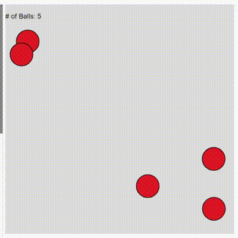

## Motivation 
Hi! This is Yuhang, currently a super senior studying IMA/CS. I have served as Learning Assistant for Creative Coding Lab for two semesters and Interaction Lab for a semester. Over the years students (and I) have run into similar problems when they try to make mini games with multiple levels or interactive stories with multiple scenes in p5.js/Processing, like "How do I move to the next scene?" So I decided to make a tutorial about how I approach this problem from scratch. I hope it helps!

## Objectives
Upon completion of this tutorials, students will:
- Review techniques covered in previous lectures, including key/mouse interaction, collision detection, and Object-Oriented Programming,
- Be able to use global variables and if statements for scene management,
- Be able to decouple "appearance" (what we draw on the canvas) and "essence" (the underlying variables that control it) and understand why we use both `update()` and `display()` methods in a class, and
- Develop problem-solving mindset.

## Table of Contents
- [Motivation](#motivation)
- [Objectives](#objectives)
- [Table of Contents](#table-of-contents)
- [Step 1: Create a single-level game](#step-1-create-a-single-level-game)
  - [1.1 Create a sketch with bouncing balls.](#11-create-a-sketch-with-bouncing-balls)
  - [1.2 Add mouse interaction so that it disappears upon click.](#12-add-mouse-interaction-so-that-it-disappears-upon-click)
- [Step 2: Insert "Start" and "Congratulations" pages](#step-2-insert-start-and-congratulations-pages)
- [Step 3: Extend the game to multiple levels!](#step-3-extend-the-game-to-multiple-levels)
- [Step 4 (advanced): Add `timer` and `life` to the game](#step-4-advanced-add-timer-and-life-to-the-game)

## Step 1: Create a single-level game
This step is built on [LA Jason's tutorial on OOP](https://github.com/LuHC409/Tutorial/tree/main/LATutor#oop) in Week 9.
### 1.1 Create a sketch with bouncing balls.
We start by declaring a `Ball` class.
```javascript
class Ball {
  constructor(x, y, radius, speedX, speedY) {
    this.x = x;
    this.y = y;
    this.radius = radius;
    this.speedX = speedX;
    this.speedY = speedY;
  }

  update() {
    // update position based on speed
    this.x += this.speedX;
    this.y += this.speedY;
    
    // if the ball hits the borders of the canvas, bounce back with speed unchanged
    if (this.x + this.radius > width || this.x - this.radius < 0) {
      this.speedX *= -1;
    }
    if (this.y + this.radius > height || this.y - this.radius < 0) {
      this.speedY *= -1;
    }
  }

  display() {
    fill(255, 0, 0);
    ellipse(this.x, this.y, this.radius * 2);
  }
}
```
Then we instantiate ball objects upon setup. To facilitate the process, I write a function called `createBalls()` and call it in `setup()`. 
```js
function createBalls() {
  for (let i = 0; i < NUM_OF_BALLS; i++) {
    // generate random values for the properties of a ball (except fixed radius)
    let radius = BALL_RADIUS;
    let x = random(radius, width - radius);
    let y = random(radius, height - radius);
    let speedX = random(-3, 3);
    let speedY = random(-3, 3);
    
    // create a new ball and add it to the array
    let ball = new Ball(x, y, radius, speedX, speedY);
    balls.push(ball);
  }
}
```

Note that I declare `NUM_OF_BALLS` and `BALL_RADIUS` at the beginning of the program and reference them when creating balls. This way, I don't have to go find messy implementation details down there (especially when the program gets super long) and only need to change the values up front.

```js
// configuration
let NUM_OF_BALLS = 5;
let BALL_RADIUS = 20;
```

The following code snippet displays a message on canvas, stating the number of balls. This can be helpful for debugging as well as for users to check out their progress.
```js
// display # of balls on canvas
push();
fill(0);
text(`# of Balls: ${balls.length}`, 0, 25);
pop();
```
We get something like this:



Code available here: https://editor.p5js.org/ztothey2dah/sketches/xsLD3Csyq

### 1.2 Add mouse interaction so that it disappears upon click.

Now we would like to add a feature, so that when we click on an object, it disappears. However, even though we can see with our eyes that we definitely have clicked  the circle, the computer program cannot tell because it only sees pixels. Luckily, we have stored each object with their coordinates in the array `balls`. 

Recall from high school math that if the distance between a point and the center of a circle is less than the radius, the point is within the circle. We need to ask the program the same thing for all the balls every time mouse is pressed.

```javascript
function mousePressed() {
  let n = balls.length; // n is the number of balls
  let i = 0; // the index of the ball we're currectly inspecting
  
  // when i == n , all n balls has been checked, break the loop
  while (i < n) {
    if (dist(mouseX, mouseY, balls[i].x, balls[i].y) <= balls[i].radius) {
      balls.splice(i, 1);
      n--; // update the number of balls
      break; // we intend to click on one object only, it's safe to break the loop
      // we don't need to update index here because we delete the old balls[i],
      // and the new balls[i] has not been checked yet
    }
    
    i++; // update the index to check the next ball
  }
}
```

Code is available here: https://editor.p5js.org/ztothey2dah/sketches/c7UZ_KcVe

## Step 2: Insert "Start" and "Congratulations" pages

In Step 1, we created a mini game. Now what? What if we want to embed this "game" into a larger context? How do we organize the code so that the bouncing balls only appear on the canvas after I start the game, and a congratulations page will show after I clear all balls?

Easy! All we need is some global variables that represents the states of the game, with the help of some `if`-statements. 

Let's try the old-fashioned pen and paper sketch, list all the "scenes" you want in your project, and specify how you will transition from one to another. For example:


Now let's think about how to represent them in a computer program. How about an integer, where `0` represents the start page, `1` represents the actual game, and `2` is the congratulations page? Let's call it `currentLevel` (or any other name you think is appropriate). 

We also need a variable `allClear` that represents whether all balls have been eliminated. And we check this every time this may happen, i.e. when we splice a ball object from the array, and set it to `true` when the array becomes empty. Let's call it `allClear` (or, again, any other name you think is appropriate). At the start of the program, we declare the global variables
```js
// game states
let currentLevel = 0;
let allClear = false;
```

To modify the code within `mousePressed()` function accordingly, so that it only works when `currentLevel` is set to `1`. 
```js
function mousePressed() {
  if (currentLevel == 1) {   // <-- so that the the program does not react to
                             // mouse press at the start/congratulations page
    let n = balls.length;
    let i = 0; 

    while (i < n) {
      if (dist(mouseX, mouseY, balls[i].x, balls[i].y) <= balls[i].radius) {
        balls.splice(i, 1);
        n = balls.length;
        if (n == 0) {       // <-- when n equals 0, no more balls
          allClear = true;  // <-- set `allClear` to true
        }                   // <-- 
        break;  
      }

      i++;
    }
  }                        // <-- end of if
}
```

And inside the `draw()` loop, we have 
```js
// draw scenes based on the current level
if (currentLevel == 0) {
  drawStartPage();
} else if (currentLevel == 1) {
  // display # of balls on canvas
  push();
  fill(0);
  text(`# of Balls: ${balls.length}`, 0, 50);
  pop();

  // update and display balls
  for (let ball of balls) {
    ball.update();
    ball.display();
  }
} else if (currentLevel == 2) {
  drawCongratsPage();
}
```

The if statements above tell the program what to draw for each game level. The following code snippet gives instruction on what to do under each level. In this way, we isolate the effects within each pair of curly brackets so they don't mess up with each other.
```js
// update levels if certain interaction is triggered
if (currentLevel == 0) {
  if (keyIsPressed && key == " ") {
    currentLevel = 1;
    createBalls();
  }
} else if (currentLevel == 1) {
  if (allClear) {
    currentLevel = 2;
  }
} else if (currentLevel == 2) {
  if (keyIsPressed && key == " ") {
    currentLevel = 1;
    allClear = false;
    createBalls();
  }
}
```
The flowchart may look like this:


Demo:


You can try the the tutorial here: https://editor.p5js.org/ztothey2dah/sketches/dvB5Fy7CC


<!-- Or, if you are making an interactive story, what situation will trigger which storyline:

 -->

## Step 3: Extend the game to multiple levels!


## Step 4 (advanced): Add `timer` and `life` to the game

BUT (there’s always a but) don’t let this practice hold back your imagination and creativity! 
